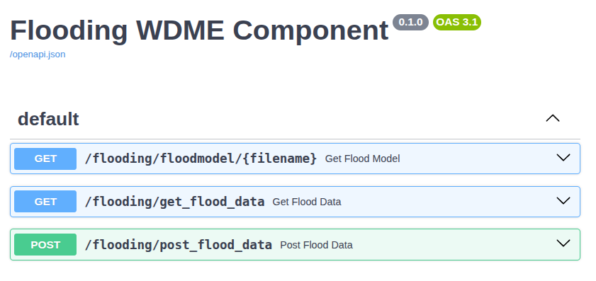
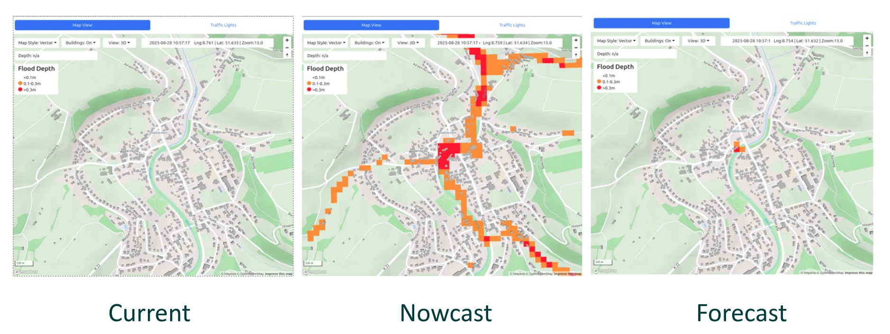
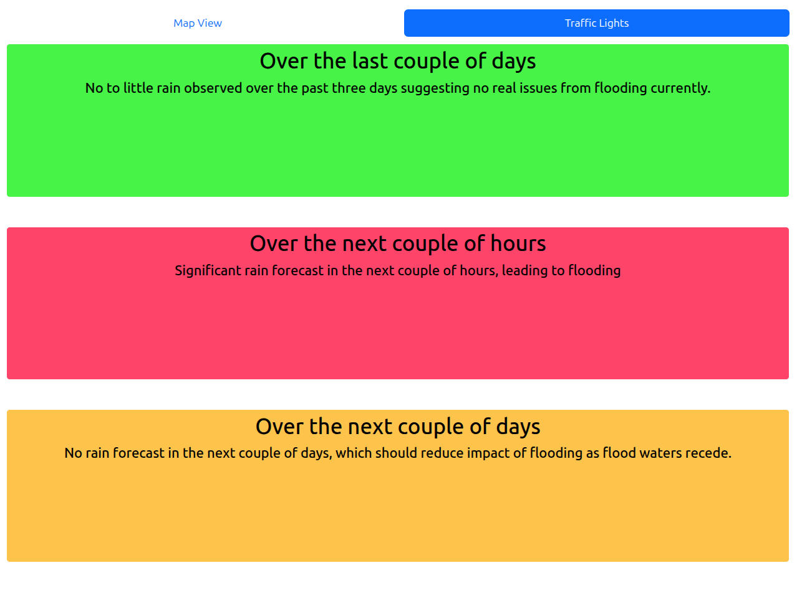

# waterverse-flood-simulation-component

## Table of Contents
- [Overview](#overview)
- [Functionality](#functionality)
- [Flood Simulation Package](#Flood-Simulation-Package)
- [WDME Flood Simulation Component](#Flood-Simulation-Component)
- [Installation](#installation)
- [Configuration](#Configuration)
- [Limitations](#limitations)
- [Acknowledgments](#acknowledgments)

## Overview
This is the Flood Simulation (FS) component project for WATERVERSE. It comprises a CAFlood-based wrapper Python package to generate flood results for the Etteln case study and a WDME flood simulation component to provide a web-based interface to access the associated Python package.

The overall concept and operation of the flood simulation component is explained in this paper:
 [https://dx.doi.org/10.15131/SHEF.DATA.29921135.V1](https://dx.doi.org/10.15131/SHEF.DATA.29921135.V1)

## Functionality

### Flood Simulation Package
The flood simulation package is effectively an Etteln-specific wrapper for CAFlood (https://cafloodpro.com/) a cellular automata-based flood simulation framework.
The package consists of three core files: rainfall_model.py, wdme_results.py and visualisation.py. In addition, the testbed.py file demonstrates how the flood simulation package can be used locally to generate flooding results and as an input to the flood simulation component using HTTP requests.

The rainfall_model file has a run() method, taking a set of historic and forecast rainfall data and will return flood data, consisting of a ‘current’ view based on the last three days rainfall (last 72 hours), a ‘nowcast’ based on the next 2 hours forecast, and ‘forecast’ based on the next 3 day forecast. Given the nature of flood prediction, this function can take some time to complete (in the order of minutes) given the hardware it’s running on and the complexity of rainfall. In general, simulation time is proportional to rainfall, i.e. more rainfall will take longer to simulate.

The input data format for rainfall consists of 7 buckets of historic temporal data and 4 buckets of forecast data:

    {
        Last72Hour:float,
        Last24Hour:float,
        Last12Hour:float,
        Last4Hour:float,
        Last2Hour:float,
        LastHour:float,
        Last5Minutes:float,
    
        Forecast2Hour:float,
        Forecast0To24:float,
        Forecast24To48:float,
        Forecast48To72:float,
    }

The return data from the run() method is passed into wdme_results.create_results() which generates data specifically for the WDME:

    {
        timestamp:datetime_string,
        traffic_lights: #textual flooding summary 
        color_key: #colourmap for visualisation
        geojson: #array of urls for geojson flood data for current, 
                 #nowcast, and forecast flood visualisations
    }

### Flood Simulation Component
The flood simulation component is a fastapi-based webapp featuring a set of apis for flood simulation processing (using the core flood simulation package) and a website to view flooding results. The website visualisation is provided primarily as a proof-of-concept, given that the visualisation component of the WMDE is expected for operational visualisation.

The flood simulation component has three api endpoints that are accessible through openapi:

The post method (/flooding/post_flood_data) is used by the WDME to pass rainfall data into the flooding component in order to generate flood results. The component effectively wraps the flood simulation package to perform this processing.

The /flooding/get_flood_data method will return the data format described in the previous section (as wdme_results), and the /flooding/floodmodel/{filename} will retrieve the geojson files, again as defined in the wdme_results. 

The flooding component website provides two forms of ‘debug’ or validation viewing: the ‘map view’ showing flood evolution in the town and the ‘traffic lights’ showing a simplified textual summary of the historic, nowcast, and forecast flood predictions.

Map view:

Traffic Light view:
 

## Installation
Both components have been developed using pipenv (https://pipenv.pypa.io/en/latest/) and are designed for Python 3.13+.

## Configuration
Within the WDME, the flood simulation component is designed to be called with live data from Etteln’s rainfall sensors and the state metrological service. This data is not available outside of the WDME, so the synthetic data generator (SDG) has been used to create plausible rainfall patterns.

### Flood Simulation Package
The testbed (testbed.py) provides a set of options to run the flood simulation locally, i.e. within the package, using etteln_payload.json provided as part of the SDG package.

The testbed also provides a set of options to pass flood simulation requests to the flood simulation component using the post method, however, this requires the flood simulation component server to be running.

### Flood Simulation Component
The flood simulation component can be triggered through its openapi interface (/docs) and passing rainfall data into the /flooding/post_flood_data api. This data can be generated through the SDG (again, using its openapi interface), though care must be taken to remove the array wrapper from the SDG returned data.

## Limitations
* Both packages (flood simulation and WDME component) were developed as research proof of concepts and are not intended for operational environments.
* The flood simulation package is defined for the Etteln case study and uses Etteln-specific elevation, land usage and rainfall maps as inputs for CAflood. Re-working the flood simulation package to another location will require these files to be replaced.
* For simplicity, the flood simulation component has had the background flood processing removed. The result of this is that the post request to generate flood results will hang until the flood simulation is complete. This can take a considerable amount of time >1min which may result in the request timing out.

## Acknowledgments

This project has been funded by the [WATERVERSE project](https://waterverse.eu/) of the European Union’s Horizon Europe programme under Grant Agreement no 101070262.

WATERVERSE is a project that promotes the use of FAIR (Findable, Accessible, Interoperable, and Reusable)
data principles to improve water sector data management and sharing.

